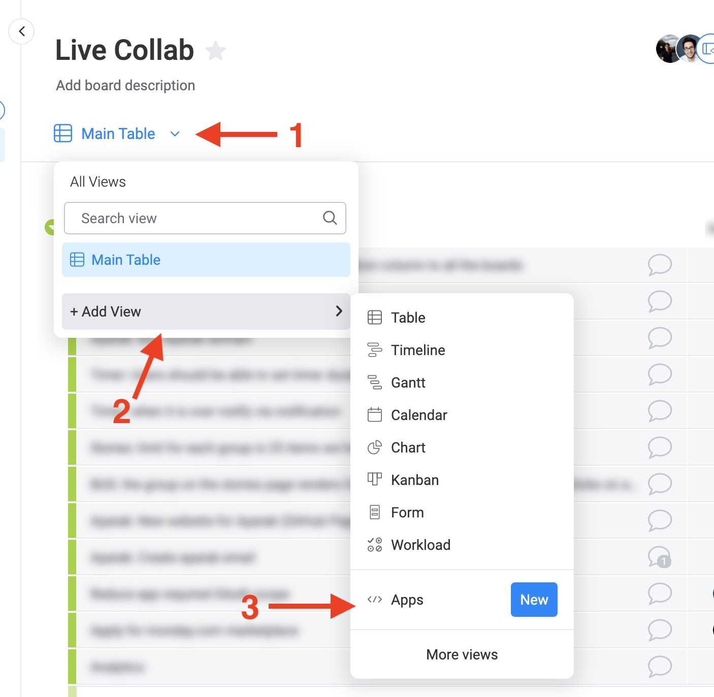
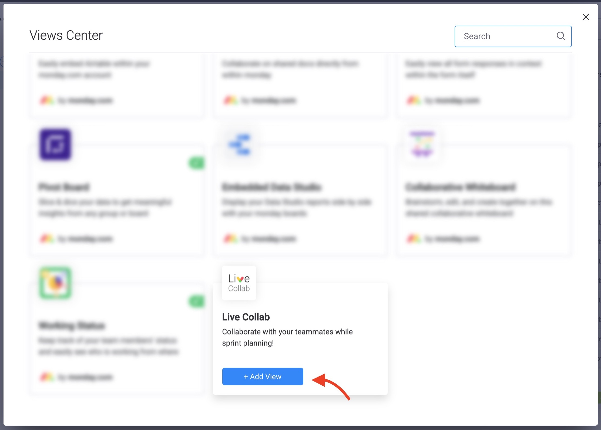
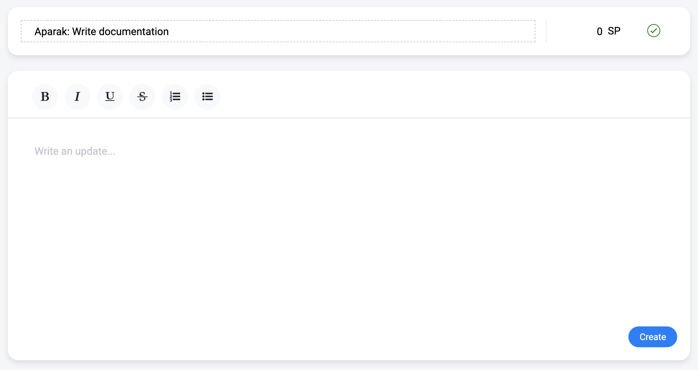
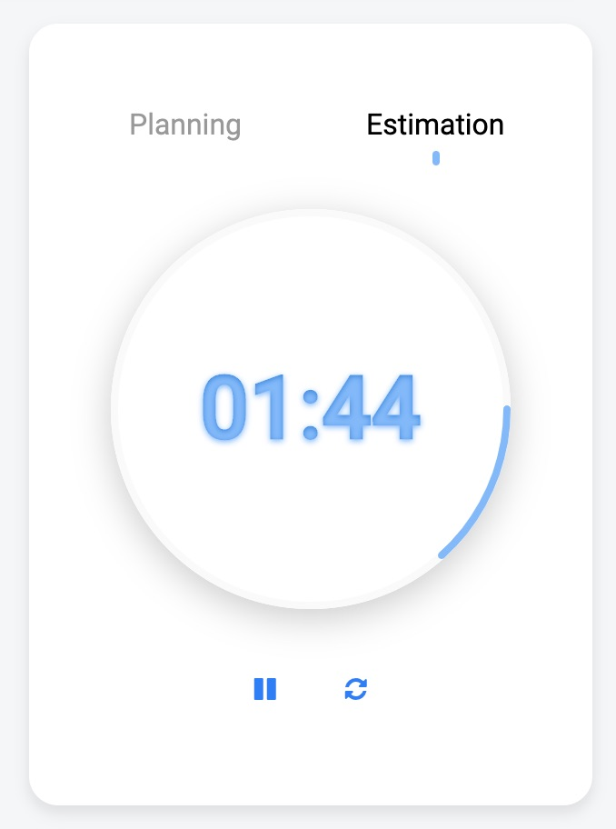

Live collaborative app for sprint planning on [monday](https://monday.com). Think of it as a Google docs, plus planning poker in one app. Oh! Also, there is a timer that is synced among your teammates!

## Who is it for?

It's for your team, to collaborate live while creating or updating tasks with some mini-apps (widgets) to help you along the way!

## What does it do?

It helps your team better collaborate together while doing sprint planning or review, writing user stories, or having any meeting with your team while going over your monday.com boards by providing a set of great tools.

## Installation

Install LiveCollab on your monday.com workspace by clicking on the link below:

Open the board on which you want to use LiveCollab and add the view:

### Live collaboration on updates

The story (item) title and updates are a collaborative text area. Teammates can type simultaneously, fix their typos, and highlight texts (think of it as a mini Google Docs).

### Timer app ⏳

The timer keeps your story planning in check (time-wise), so your team won't go over time.

### Estimation app 🤔

This app will help your team estimate tasks (think of it as planning poker, but you don't need to leave the monday.com app!)
